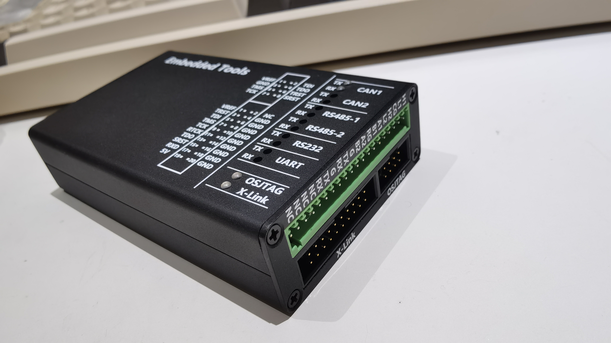
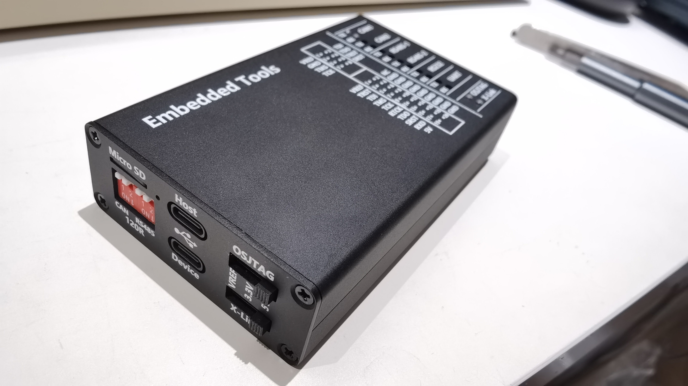

## 简介
多功能嵌入式调试工具，特性如下：
* 2 路 CAN 接口；
* 2 路 RS485 接口；
* 1 路 RS232 接口；
* 1 路 UART 接口；
* 1 个 X-Link；
* 1 个 OSJTAG(OSBDM)；
* 1 个 Micro SD 读卡器；
* 1 个 USB 集线器；
* USB 设备端、CAN、RS485、其它接口之间相互隔离；
* 支持拨码选择是否连接 CAN、RS485 的 120Ω 终端电阻；
* X-Link、OSJTAG 支持开关选择 Vref 引脚功能为连接目标板 Vref、输出 3.3V/5V；
* USB 主机、X-Link、OSJTAG 电源输出支持过流、短路以及防电流倒灌功能；

## 实物图

## 固件
1. X-Link 目前提供 V9 版模块，固件请在网上自行搜索；
2. OSJTAG 固件开源链接：[osbdm_hpm5301_software](https://github.com/zhangjinke/osbdm_hpm5301_software)；
3. CAN 固件请到 moonglow 大佬仓库搜索 1610 获取，上位机可使用 BUSMASTER。

## 注意事项
1. X-Link、OSJTAG、UART 的 IO 电平范围为 1.65V~5V，且 UART 接口电平与 OSJTAG 电平相同；
2. 连接 2 块主板的 1.27mm 间距，长度 11mm 的排针，请参考 IMG_20241118_211116.jpg 的方式，将长的部分缩短 0.5mm 左右；
3. 电脑端看到的串口 A、B、C、D 分别对应 RS485-1、RS485-2、RS232、UART；
4. 实测 USB 设备端电流 200+mA，若无法使用，请确保 USB 线质量与 USB 口供电能力；
3. USB 设备端隔离由于成本较高，可通过 0R 电阻替代；
4. SGM7222 为预留器件，请勿焊接。通过 R46、R47 焊接 0R 电阻替代。

## 后续计划
1. 增加 Linux 核心板、触摸显示屏、电池，实现离线烧录、升级、调试功能；
2. 增加 OSJTAG 固件功能，比如 DAPLink、USB 转 I2C、USB 转 SPI，模拟 2232 等；
3. 增加更多的 X-Link 模块。

## 声明
1. 您可以自由地对本项目进行修改和二次开发，但请务必在您的作品中注明原作者及原项目链接；
2. 本项目仅供个人、教育和非商业使用。**任何商业用途均需获得作者的事先书面许可**。